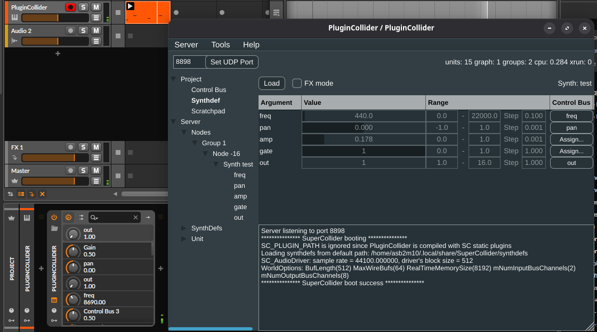

PluginCollider
==============

PluginCollider is a generic (cross-platform/plugin format) wrapper that allows using a [SuperCollider](https://supercollider.github.io/) server inside a VST3 plugin. The embedded server may be controlled over OSC as usual.

Now support Linux, macOS and Windows.

*PluginCollider is based on AU version of https://github.com/supercollider/SuperColliderAU*

# Changelog
## Version 0.5.2 (In development)
* Added more precision for ranges

## Version 0.5.1
* Added server configuration options
* On macOS, support loading external SuperCollider plugins installed by the user

## Version 0.5.0
* Hybrid plugin mode; standard SuperCollider plugins are statically linked but can still loaded extended plugins

## Version 0.4.0
* Multiple SynthDef snapshot tree configuration: route midi SynthDef outputs to dedicated SynthDef effects
* Support for array parameters
* Fix synthDefPath persistence change on the same VST session

## Version 0.3.1
* Fix sessions issue upon reloading plugin FX

## Version 0.3.0
* Added TreeView to browse active objects from the server (Node, Buffer, Synthdefs, Unit). This is still a work in progress since it will be the editor to push the desired node hierarchy.
* You can now assign a name and range values to plugin parameters that will be exposed as a controlbus on SuperCollider.
* You can now assign a controlbus on a synthdef parameter upon synth instanciation
* UIUGen units (MouseX, MouseY, MouseButton) are now available by using JUCE events

## Version 0.2.1
* Fixed [crash](https://forum.juce.com/t/accessible-list-box-row-segfault-crash-on-exit/51162) on pluginwindow close
* Avoid sending midi notes events if the plugin is in FX mode

# State of the project

SuperCollider is a highly modular ecosystem (sc-plugins, scsynth definitions) that needs to be adapted for each platform from the VST3/clap component. For now consider this as a vanilla scsynth implementation with no external plugins.

Latest build are available from [https://github.com/asb2m10/plugincollider/actions](https://github.com/asb2m10/plugincollider/actions)

# Usage - SynthDefs files

PluginCollider can load previously compiled [SynthDefs](resources/scsyndef) (*.scsyndef) that will be saved within the DAW plugin state. No installation/usage of Supercollider afterwards is required if you want to exclusively use scsyndef files.

Follow [PluginCollider WIKI](https://github.com/asb2m10/plugincollider/wiki) for more information.

# Known issues

* Be sure to set your DAW latency size to a power of two (256, 512, 1024) otherwise some SC plugins might not work properly.
* If you are running multiple VST instances, scsynth errors messages might end up into one specific unrelated vst logs since scsynth is design to be run into one single process. Some DAWs has a "Dedicated process" runtime that might resolve this issue.
* On Windows, if you are using the github releases, be sure to update the [MSVC Runtime](https://learn.microsoft.com/en-us/cpp/windows/latest-supported-vc-redist?view=msvc-170#visual-studio-2015-2017-2019-and-2022) to the latest version

# TODO
- [ ] add [CLAP](https://github.com/free-audio/clap) plugin format
- [x] assign scsyndef parameters to controlbus (and plug parameters values)
- [x] multi scsyndef support
- [x] implement /freq and /amp from DAW midi message
- [o] *macOS* enable PluginCollider to use SuperCollider scsynth plugin that the user previously installed (handle notarization)
- [o] *Windows* bundle sndfile.dll within the plugin installation
- [ ] more accurate OSC DAW timing

# Build instructions

Be sure to install SuperCollider and JUCE dependencies; dont forget [sndfile](https://github.com/libsndfile/libsndfile) on Linux. Then clone recursivly the repository and build PluginCollider like a normal cmake project :

    git clone --recursive https://github.com/asb2m10/PluginCollider
    cd PluginCollider
    mkdir build
    cd build
    cmake ..       # add `-G Xcode` if you want to use Xcode
    make
